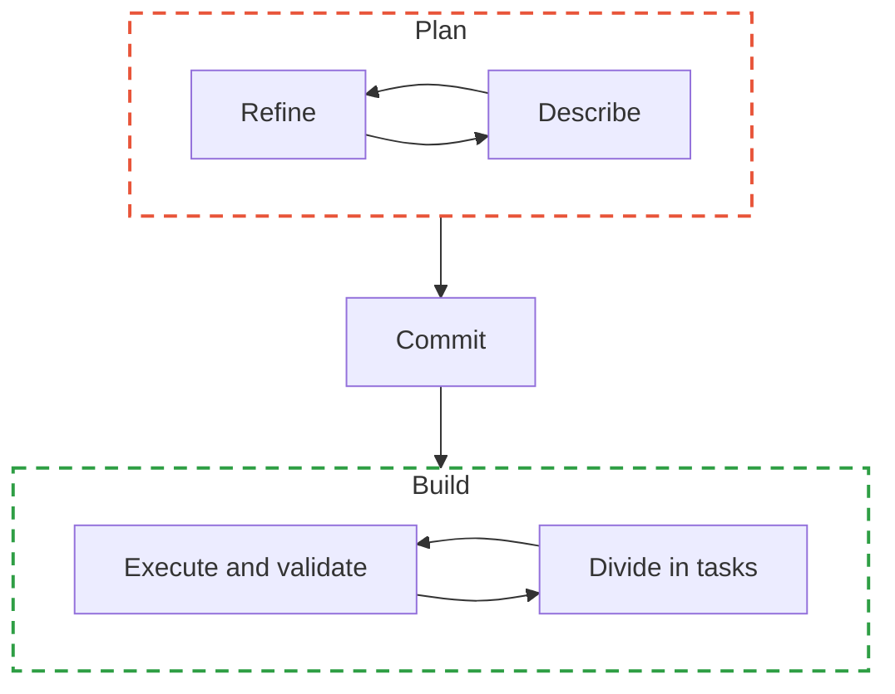

# Spec Driven Development (SDD)



1. **Describe** the problem, not the solution, define use case: user stories, acceptance criteria. 

```markup
## Project Context
**Primary user:** Active job seekers
**Objective:** Improve CV quality to strengthen the professional profile

### Story 1: Upload CV for analysis
**As a** job seeker
**I want to** upload my CV in PDF or text format
**So that** the system can analyze it and compare it with job offers

**Acceptance criteria:**
WHEN a user uploads a CV file in PDF format
THE SYSTEM MUST correctly extract the document's content
```

1. **Refine**, make sure use case is covered, this is the internal talk with the AI to make sure everything aligned. Save all these requirements in a markdown file like **`requirements.md` .**
2. **Commit**, design blueprint, turn requirements into a clear technical plan for architecture, used components, technologies, etc. Save the blueprint in a dedicated file **`design.md`**  with architectural diagram, data flow, component interfaces and error handling strategy.
3. **Divide** design concrete,testable and incremental in **tasks**. Every task must reference the spec is implementing and builds from the previous one. Save this on a **`tasks.md`** file.
4. Make the build agent **execute** each task ****and **validate** the output (reviewing, manually testing, adding automatic tests to the loop). Iterate until tasks completion.