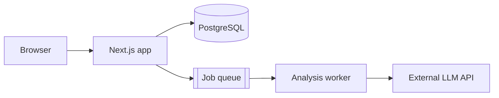
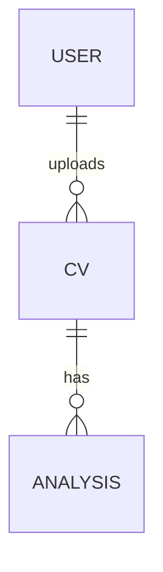

# Steering template — `architecture.md`

Reference for `.sdd/steering/architecture.md`: **the general design of the whole system, from the most general view.** Each spec's `design.md` zooms into one feature; this file is the zoomed-out map they all fit into. It is the first thing to read before designing a new spec. **It is not text to be copied verbatim** — fill each section from the actual code, and omit sections that do not apply.

Keep it short (under ~150 lines). It describes the system **as it is implemented today**, not plans. It is updated by `/spec-impl` after each spec is implemented, from that spec's **Steering impact** section.

The template follows between the two horizontal rules. It is shown rendered (not inside a code fence) so the Mermaid diagrams preview correctly. When writing the real file, keep each diagram as a top-level ` ```mermaid ` block, never nested inside another code fence.

---

# Architecture

> **Last updated:** YYYY-MM-DD · by SPEC NN (or "initial generation")

## System overview

Two to four sentences: what kind of system this is (e.g. "Monolithic Next.js app with a PostgreSQL database and one background worker") and its main architectural style.

## System diagram



## Components

| Component        | Location         | Responsibility                      | Introduced by |
| ---------------- | ---------------- | ----------------------------------- | ------------- |
| Web app          | `src/app/`       | UI and HTTP API                     | —             |
| CV module        | `src/cv/`        | Upload, parse and store CVs         | SPEC 01       |
| Analysis worker  | `worker/`        | Compare CVs against job offers      | SPEC 02       |

## Data model (high level)

The main entities and their relationships. Detailed fields live in each spec's `design.md`.



## Main data flows

- **CV upload:** Browser → `POST /api/cv` → parser → `cv` table. (SPEC 01)
- **Analysis:** …

## External integrations

| Service      | Used for            | Where it is called |
| ------------ | ------------------- | ------------------ |
| OpenAI API   | CV analysis         | `worker/analyze.ts` |

## Cross-cutting concerns

- Authentication, authorization, error handling, logging, configuration — one line each on how the system handles them.

## Architectural decisions

- **Decision** — reason. (SPEC NN)

---

Tag components, flows and decisions with the spec that introduced them, so a reader can jump to the full reasoning in that spec's `design.md`.
