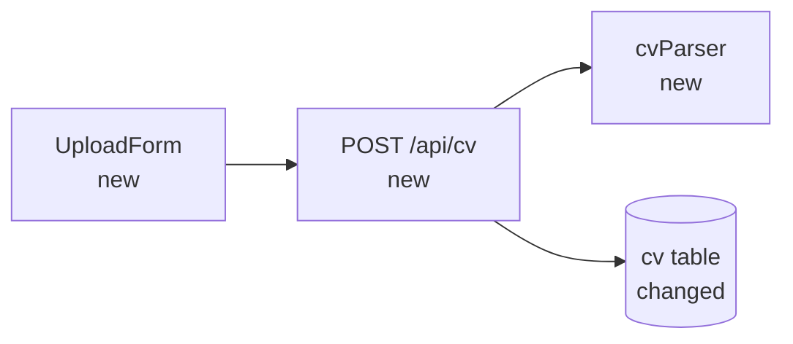
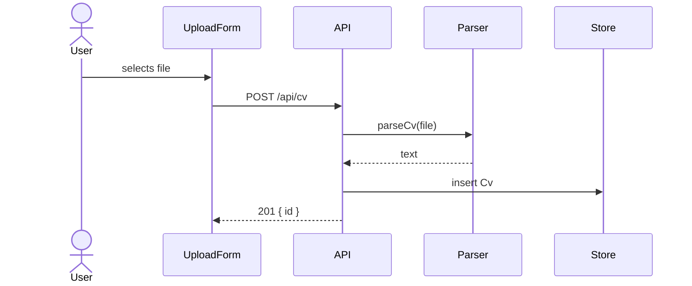

# Template — `design.md`

This file is the reference the `/spec` skill consults when writing `design.md`, the second of the three spec documents. It turns the approved requirements into a **technical blueprint**: architecture, components, data, flows, error handling and the decisions behind them. Each section includes its purpose and a minimal example. **It is not text to be copied verbatim** — it is the shape the skill must respect.

The design must be consistent with the project's steering files (`.sdd/steering/`). If it deliberately departs from them, say so in **Decisions** and record the change in **Steering impact**.

---

## Header

No status here — the spec's single `Status` line lives in `requirements.md`.

```markdown
# SPEC NN — Short, descriptive title · Design

> **Spec:** [requirements](./requirements.md) · design · [tasks](./tasks.md)
```

---

## Section 1 — Overview

Three to five sentences: the shape of the solution and how it fits into the existing system (as described in `.sdd/steering/architecture.md`).

---

## Section 2 — Architecture

A Mermaid diagram of the components involved and how they connect. Mark new components and changed components so the reader sees the delta.



Keep it to the components this spec touches plus their direct neighbors. The whole-system view lives in `.sdd/steering/architecture.md`.

---

## Section 3 — Components and interfaces

One entry per new or changed component: its file path, its responsibility in one line, and its public interface (signatures, routes, props, events). Use real names.

```markdown
## Components and interfaces

### `src/cv/parser.ts` (new)

Extracts plain text from an uploaded file.

- `parseCv(file: Buffer, mime: "application/pdf" | "text/plain"): Promise<string>`
- Throws `CvUnreadableError` when no text can be extracted.

### `POST /api/cv` (new)

- Body: `multipart/form-data` with field `file`.
- `201` → `{ id: string, chars: number }`
- `413` → file larger than 5 MB.
- `422` → `CvUnreadableError`.
```

---

## Section 4 — Data model

The concrete structures that appear or change. Use real code, not abstract pseudocode.

````markdown
## Data model

```ts
type Cv = {
  id: string;        // uuid v4
  userId: string;
  text: string;      // extracted plain text
  uploadedAt: string; // ISO 8601
};
```
````

If the feature introduces no new data, write it explicitly: _"This feature introduces no new data structures. It reuses the model from SPEC 01."_

---

## Section 5 — Data flow

How data moves through the components for the main use case. Use a Mermaid sequence diagram when there are three or more participants; a numbered list is enough otherwise.



---

## Section 6 — Error handling

Every failure mode from the requirements' unhappy paths, and how the design handles it. Reference the requirement it satisfies.

```markdown
## Error handling

| Failure                  | Where it is detected | Behavior                                  | Req. |
| ------------------------ | -------------------- | ----------------------------------------- | ---- |
| File > 5 MB              | API, before parsing  | `413`, form shows "File too large"        | 1.2  |
| PDF without text         | `parseCv`            | `422`, previous CV is kept                | 1.3  |
| Database write fails     | API                  | `500`, nothing is stored, user can retry  | —    |
```

---

## Section 7 — Testing strategy

What is tested, at which level, and with which tool — following the testing conventions in `.sdd/steering/tech.md`. If the project has no automated tests, describe the manual checks.

```markdown
## Testing strategy

- Unit: `parseCv` with a text PDF, an image-only PDF and a `.txt` file (vitest).
- Integration: `POST /api/cv` happy path, 413 and 422.
- Manual: upload from the browser and see the success message.
```

---

## Section 8 — Decisions taken and discarded

The section that has the most value 3 months from now. Capture **what you considered**, not just what you chose.

```markdown
## Decisions

- **Yes:** `pdf-parse` for text extraction. Small, no native deps.
- **No:** OCR for image-only PDFs. Too heavy for this spec; goes in another spec if needed.
- **Yes:** store extracted text, not the original file. We only need the text and it avoids file storage.
```

Each decision ideally has a brief reason. Decisions without a reason are the first ones to be questioned later.

---

## Section 9 — Identified risks (optional)

Only when there are non-obvious risks.

```markdown
## Risks

| Risk                               | Mitigation                                        |
| ---------------------------------- | ------------------------------------------------- |
| `pdf-parse` fails on malformed PDF | Catch and map to `CvUnreadableError` (req. 1.3). |
```

For small specs or very contained features, omit it.

---

## Section 10 — Steering impact

What this spec changes in the project's persistent context once it is implemented. `/spec-impl` reads this section after the last task and applies it to `.sdd/steering/`. **`/spec` does not modify the steering files itself.**

List one bullet per steering file affected. Write the change, not the full new text.

```markdown
## Steering impact

- `architecture.md`: add the CV module (`src/cv/`) and the `POST /api/cv` endpoint to the system diagram.
- `tech.md`: add `pdf-parse` as a dependency for PDF text extraction.
- `structure.md`: no change.
- `product.md`: add "CV upload and analysis" to the main features.
```

If nothing changes, write: _"No steering changes."_

---

## Global rules

- **Concrete names.** If you say "the levels module", say `src/levels.js`. If you say "a key", give the exact string.
- **Every requirement is covered.** Each acceptance criterion in `requirements.md` must be traceable to some component, flow or error-handling row.
- **Nothing outside the scope.** If the design needs something the requirements do not ask for, go back to the requirements.
- **No long executable code.** Signatures, types and short snippets are fine; full function bodies are not.
- **No TODOs.** Make the decision or note it as open with a reason.
- **Standard markdown + Mermaid.** It must render on GitHub without surprises. Diagrams go in a top-level ` ```mermaid ` fenced block — never nested inside another code fence, or previewers show them as plain code.
